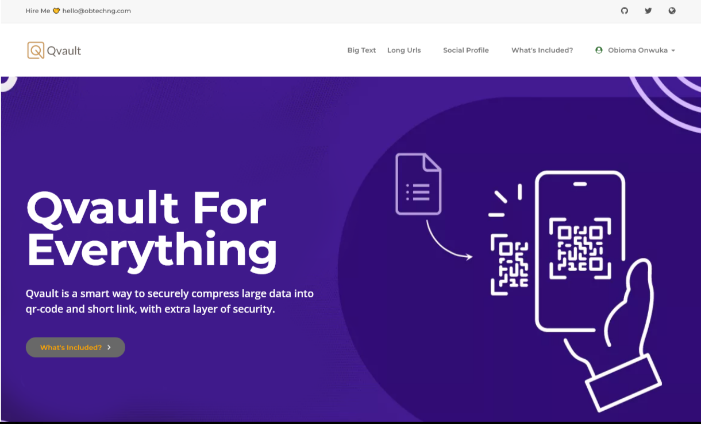

# Qvault
# Everything-in-1 web app for compressing data into Qr-code, with extra layer of security, using 2FA.
# Registration is not necessarily needed, but if you would want to keep track of your data, and how it is being used, you might need to create an account.
# With an account, anyone that wishes to access your compressed data, would be required to provide a 6-digit code sent to your email (2FA), otherwise, the data remains invisible.
# On the other hand, if you just want to compress data and share freely, you do not need registration.
# All data are encrypted before storage.
# Qvault is free.
# HTML + CSS + Laravel = Qvault.
# Part of my backend projects as presented by https://obtechng.com
# Find me on twitter @obioma_onwuka
# 
#
# Notes
#
# 
#
#
# URLs
#
# 
#
#
# Social Profiles
#
# 
